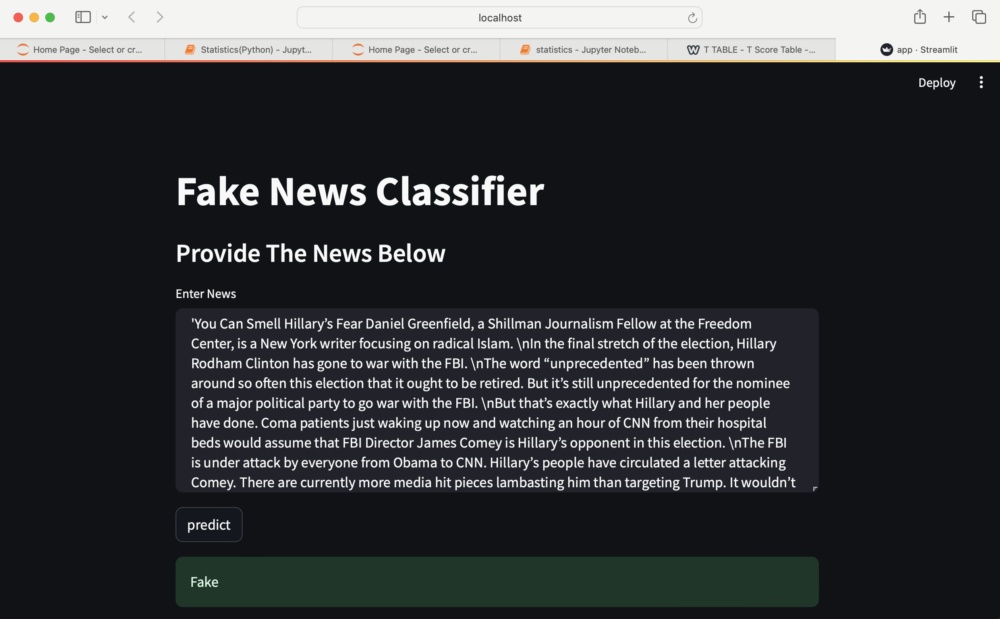
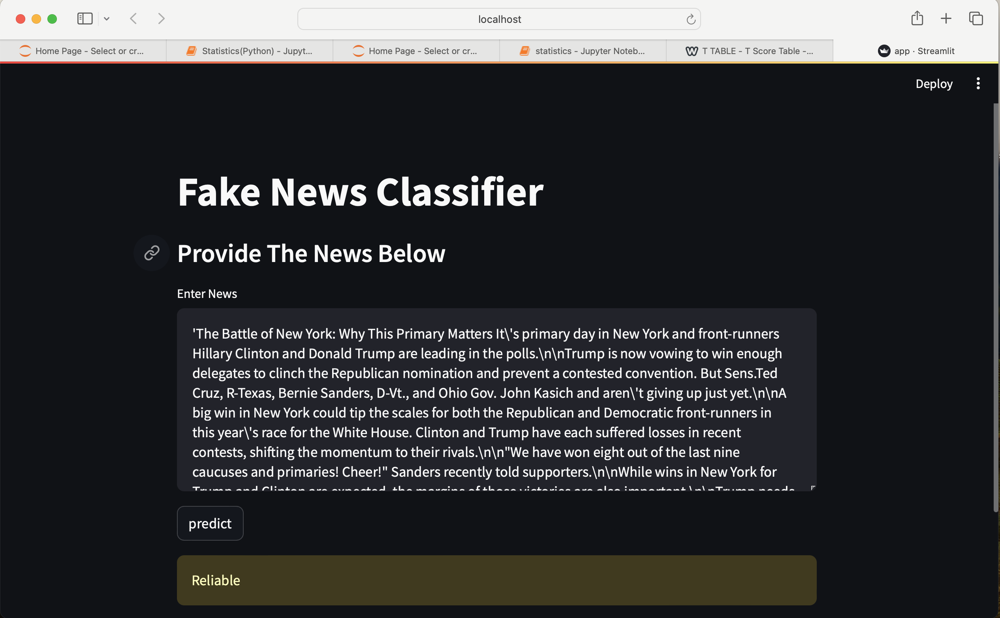

# Fake News Classifier

## Overview
This project aims to classify news articles into reliable and fake categories using machine learning models. The implementation includes a Streamlit web application that provides users with an interface to input news articles and receive predictions.

## Project Structure
- `app.py`: Streamlit web application code.
- `vectorizer.pkl`: Pickle file for the TF-IDF vectorizer used in text preprocessing.
- `pac.pkl`: Pickle file for the trained Passive Aggressive Classifier model.

## Installation
1. Clone the repository:
   ```bash
   git clone https://github.com/ravina029/FakeNewsClassifier.git
   cd fake-news-classifier


2. Install dependencies:
pip install -r requirements.txt

3. Run the Streamlit app:
streamlit run app.py


# Usage
1. Open the Streamlit app in your browser.
2. Enter a news article in the provided text area.
3. Click the "Predict" button to get the classification result.

# Screenshots of the App




# Technologies Used:

1. Python
2. Streamlit
3. Natural Language Processing (NLP)
4. scikit-learn
5. GitHub

# Key Features:
1. Datset link: data is downloaded from kaggle, https://www.kaggle.com/datasets/hassanamin/textdb3/data.
2. Trained a machine learning model on a dataset of above news articles.
3. The machine learning model uses a Passive Aggressive Classifier trained on TF-IDF vectorsand gave an accuracy of >92%. 
4. NLP techniques for text preprocessing.Text preprocessing involves stemming and stop word removal.
5. Scikit-learn for the machine learning model.
6. Streamlit for the web application.

# Results:

1. The project successfully detects and classifies news articles as reliable or fake.
2. Achieved accuracy of >92%.


# Future Improvements:

1. Explore additional NLP techniques for better feature extraction.
2. Enhance the user interface for a more engaging experience.


